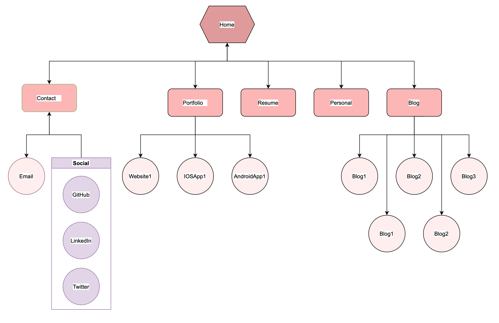

# Link to my published Portfolio

https://kimbstocker.github.io/portfolio/

# Link to my GitHub Repo

[GitHub Repo](https://github.com/kimbstocker/KimStocker_T1A2)

# Website description

A portfolio page to showcase my projects, professional skills and experience, resume, personalities & blog posts. 

## Purpose of the website

To help recruiters get an overview of my coding skills through the portfolio itself. Everything you need to know about my past projects, knowledge and experience. 

Hope to get more exposures by Twitter & GitHub followers and LinkedIn connections even if the recruiters do not get in touch the first time. 

Encourage recruiters to revisit for improved contents/coding skills & hopefully keep in view for more appropriate roles and future opportunities.

## Functionality / features

- All pages are designed to be responsive to different viewports.
- Nav bars for ease of navigation within the page.
- Personalised greeting and thank you note.
- Little This or That game to improve user experience.

## Sitemap

## Screenshots

## Target audience

- Recruiters with and without technical background.
- Friends, families, ex-colleagues and others for feedbacks and referrals.

## Tech stack 

- Html
- CSS
- SCSS
- JavaScript
